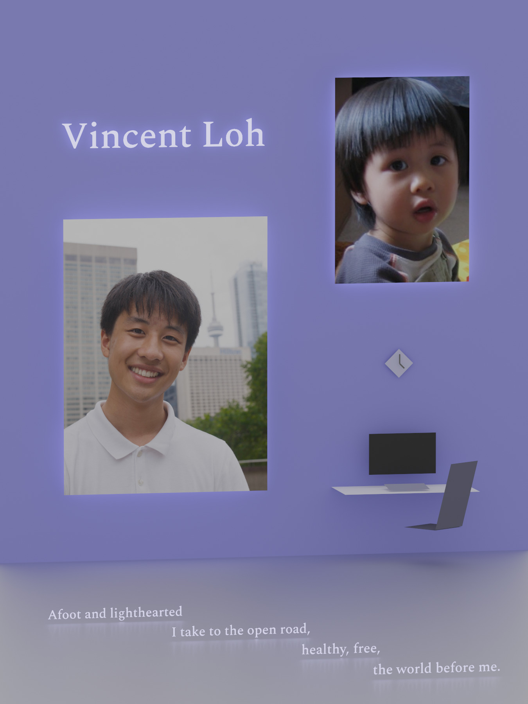

Finetuned ray-tracer adapted from my previous project [https://github.com/vmhl87/path-tracing](https://github.com/vmhl87/path-tracing), used to render my personal page in my school's yearbook.

Run singlethreaded with `make`, or multithreaded with `make threads=x` where `x` denotes the number of threads used. Parameters are currently set for maximum quality rendering; change them in `void setup_camera()` in `scene.cpp`.

Rendered with 10 threads in 1h30m on my machine.

